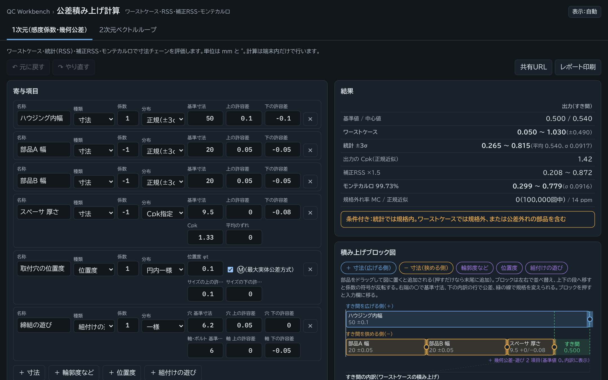
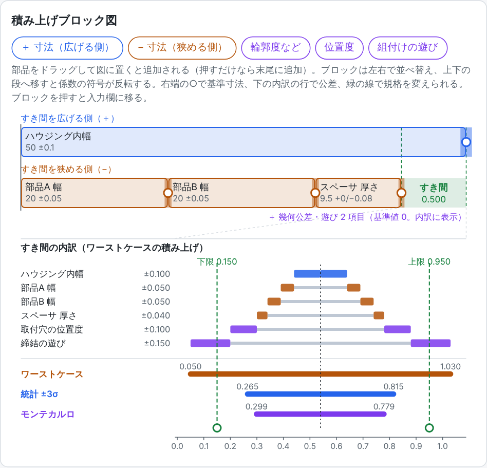
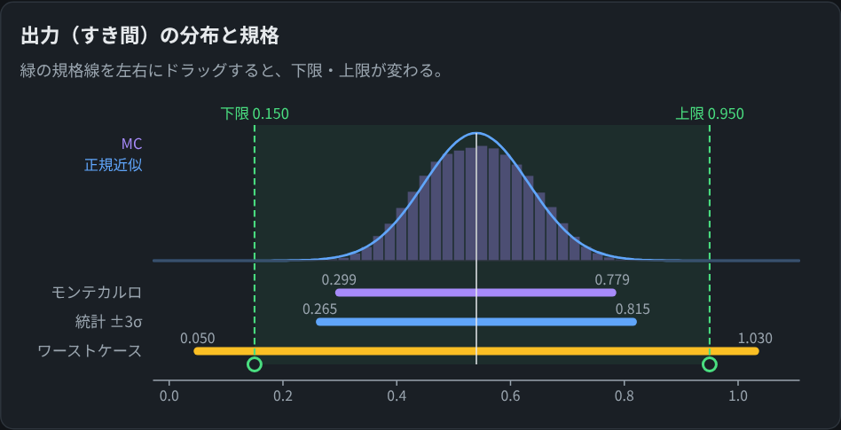
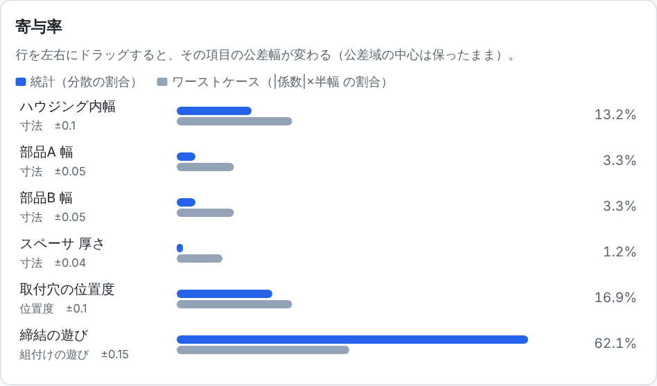
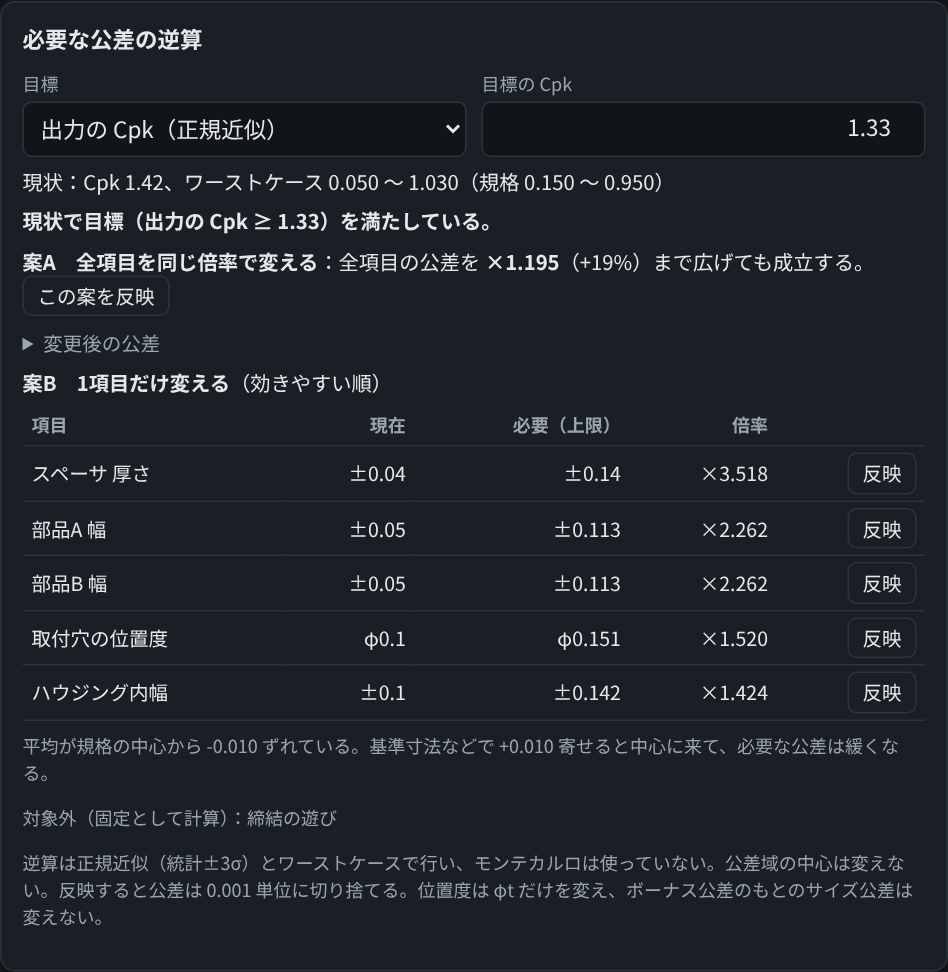
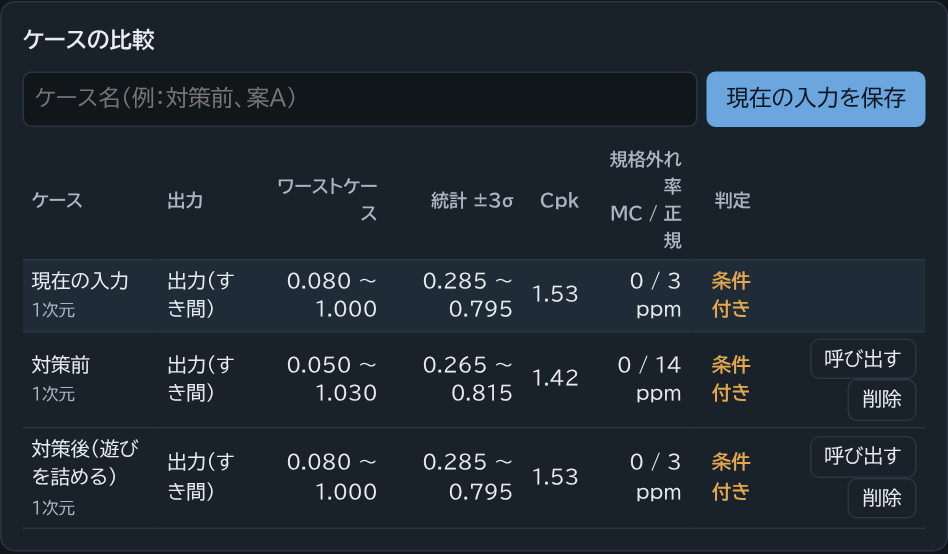
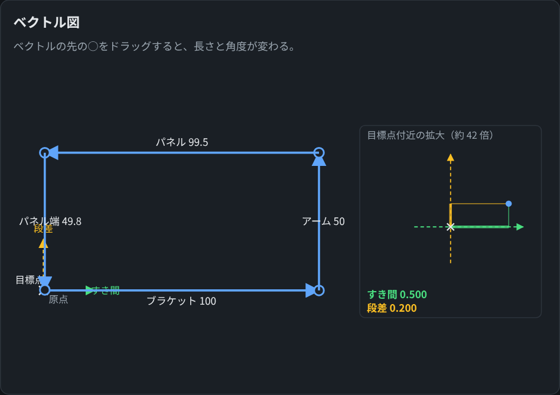

# stackup-calc

公差の積み上げ（スタックアップ）をブラウザだけで計算する Web アプリ。インストール不要で、計算は端末内で完結し、入力したデータは外部に送信しない。

**▶ すぐ使う：<https://kotaooka.github.io/stackup-calc/>**



- ワーストケース・統計（RSS）・補正RSS・モンテカルロを**同時に**計算し、規格に対する判定（合格／条件付き／不合格）を出す
- 寸法だけでなく、輪郭度・位置度（Ⓜ のボーナス公差）・組付けの遊びも寄与項目として扱える
- 2次元のベクトルループ（すき間と段差の2方向）にも対応
- どの項目が効いているか（寄与率）、どこまで公差を詰める／緩められるか（逆算）までを1画面で確認できる

---

## 使い方（1次元）

初めて開くと例題（ハウジング内幅に部品A・B・スペーサ等を並べたときのすき間）が入っている。まずはこれを触ってみるのが早い。

### 1. 寄与項目を入力する

左の「寄与項目」に、すき間を決める寸法を1行ずつ入れる。

| 欄 | 入れるもの |
|---|---|
| 種類 | 寸法 / 輪郭度など / 位置度 / 組付けの遊び |
| 係数 | すき間を**広げる**寸法は `1`、**狭める**寸法は `-1`。てこ比などがあればその値（感度係数） |
| 分布 | 正規（±3σ）、一様、三角、Cpk 指定（平均のずれも入れられる）、実測（平均・σ） |
| 基準寸法・許容差 | 図面の値。上下非対称でもよい |

`＋ 寸法` `＋ 輪郭度など` などのボタンで行を追加する。下の「規格（任意）」にすき間の下限・上限を入れると判定が出る。入力を変えると結果はすぐ更新される（モンテカルロだけは入力が止まってから別スレッドで計算する）。

### 2. 結果と判定を見る

右上の「結果」に各計算方式の範囲と、出力の Cpk・規格外れ率が並ぶ。一番下の枠が判定。

| 判定 | 意味 |
|---|---|
| 合格 | 全部品が公差内である前提が成り立ち、ワーストケースでも規格内 |
| 条件付き | ワーストケースでは規格外だが、統計（モンテカルロがあれば 0.135〜99.865%、なければ ±3σ）では規格内 |
| 不合格 | 統計でも規格外 |

実測分布で平均±3σ が公差域をはみ出す項目や、Cpk が 1 未満の項目を含むときは「全部品が公差内」の前提が崩れるため、ワーストケースでの合格判定はしない。

### 3. 積み上げブロック図で確認・編集する



上段が「すき間を広げる側」、下段が「狭める側」。その差が右端の緑の「すき間」になる。下半分は各項目の公差がワーストケースでどう積み上がるか（内訳）と、ワーストケース・統計・モンテカルロの範囲を規格線と並べて表示する。

- 上のチップ（`＋ 寸法（広げる側）` など）を図にドラッグすると部品を追加できる
- ブロックを左右にドラッグすると並べ替え、上下の段に移すと係数の符号が反転する
- ブロック右端の ○ をドラッグすると基準寸法、内訳の行の端をドラッグすると公差、緑の線で規格を変えられる

### 4. 分布と規格の関係を見る



モンテカルロのヒストグラムと正規近似の曲線に、規格線（緑）を重ねる。規格線は左右にドラッグして動かせる。

### 5. 効いている項目を見つける（寄与率）



青が統計（分散の割合）、灰色がワーストケース（|係数|×公差の半幅 の割合）。この例では「締結の遊び」が分散の約6割を占めていて、対策するならここ、と分かる。行を左右にドラッグすると、その項目の公差幅を変えられる（公差域の中心は保ったまま）。

### 6. 必要な公差を逆算する



目標（出力の Cpk ≥ 指定値、またはワーストケースで規格内）を満たすのに必要な公差を2通りで出す。

- **案A**：全項目を同じ倍率で変える場合の倍率
- **案B**：1項目だけ変える場合の、各項目の必要公差（効きやすい順）

`この案を反映` / `反映` を押すと入力に書き戻される。平均が規格中心からずれていれば、そのずれ量も表示する。

### 7. 対策前・対策後を比べる



ケース名を入れて `現在の入力を保存` を押すと、その時点の入力と結果が一覧に残る。入力を変えてもう一度保存すれば、結果が横に並ぶ。上の例は「締結の遊び」の穴・軸公差を詰めたときの比較で、Cpk が 1.42 → 1.53 になっている。`呼び出す` で保存した入力に戻せる。

---

## 使い方（2次元ベクトルループ）

上部のタブで「2次元ベクトルループ」に切り替える。



1. 「ベクトル」に、長さ（mm）と角度（°）を順に入れてループをつなぐ。角度は「x軸から」または「前のベクトルから」で指定できる。長さ・角度それぞれに許容差と分布を設定する
2. 「出力の設定」に目標点と測定方向を入れると、終点の目標点からのずれを**2方向（すき間・段差）**に分けて評価する。感度係数は数値微分で自動的に求める
3. ベクトル図の先端の ○ をドラッグすると、長さと角度を直接変えられる。右の枠は目標点付近の拡大表示

結果・分布・寄与率・逆算・ケース比較は1次元と同じように使える（出力が2つになる）。

---

## そのほかの機能

| 機能 | 操作 |
|---|---|
| 元に戻す／やり直す | 画面右上のボタン、または Ctrl+Z / Ctrl+Y |
| 共有URL | 入力を URL の `#` 以降に圧縮して埋め込む。URL を渡せば相手の画面で同じ入力が開く（サーバーには送られない） |
| レポート印刷 | 印刷用レイアウトで出力する。ブラウザの印刷で「PDF に保存」を選べば PDF になる |
| JSON で書き出し／読み込み | 入力をファイルに保存・復元する |
| 自動保存 | 入力内容とケース一覧はこの端末のブラウザに自動で保存される |
| モンテカルロの回数 | 「計算の設定」で 1万〜100万回から選ぶ。乱数の種は固定なので、同じ入力なら同じ結果になる |

---

## 計算方法の補足

| 方式 | 内容 |
|---|---|
| ワーストケース | Σ \|係数\| × 公差の半幅 |
| 統計（±3σ） | 各項目の分布から求めた σ に感度係数を掛け、二乗和平方根をとったものの ±3σ。全項目が正規分布（±3σ）なら従来の RSS と一致する |
| 補正RSS | 従来の RSS に 1.5 を掛けたもの（Bender） |
| モンテカルロ | 各項目を指定分布から発生させて出力を計算し、0.135〜99.865% 点を範囲とする |

---

## 開発者向け

### 構成

```
src/
  template.html   画面（HTML・CSS）
  engine.js       計算エンジン（画面に依存しない。Node・Web Worker からも読み込む）
  ui.js           画面の処理・図の描画・ドラッグ操作・逆算・ケース比較・共有URL・レポート
tools/build.py    src/ をまとめて docs/index.html を生成
tests/
  cases.js        例題をエンジンで計算して tests/out.json に書き出す
  verify.py       結果を Python で独立に計算し直して照合する（ワーストケースの総当たり、判定、逆算の境界を含む）
docs/index.html   ビルド結果（GitHub Pages の公開対象）
docs/images/      README 用のスクリーンショット
```

### ビルドとテスト

```
python tools/build.py
node tests/cases.js
python tests/verify.py
```

プッシュすると GitHub Actions（`.github/workflows/test.yml`）で同じ手順が自動で実行され、`docs/index.html` がビルド結果と一致しているかも確認される。

---

## ライセンス

[MIT License](LICENSE)
